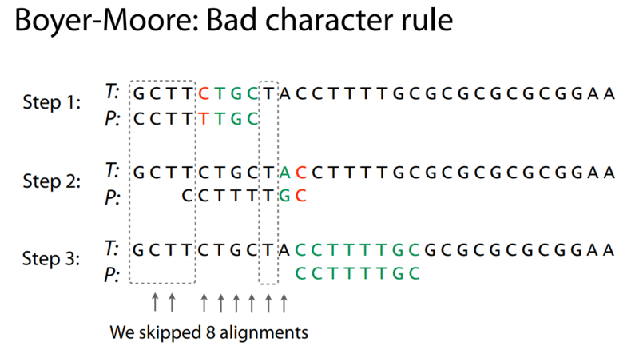
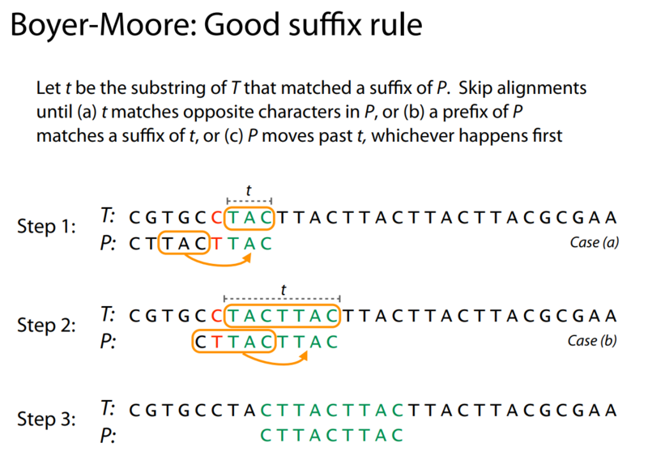
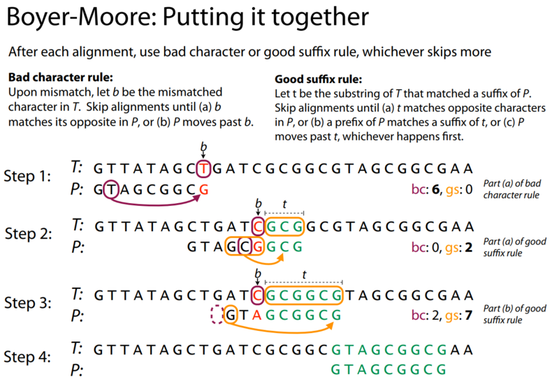

# 3. 문자열(string)

## 문자의 표현

### 컴퓨터에서의 문자 표현

메모리는 숫자만을 저장할 수 있기 때문에 문자를 저장하기 위해서 활용되는 방법

코드 체계 : 영어가 대소문자 협쳐서 52이므로 6(2^6=64가지)비트면 모두 표현 가능

ex) 000000 => 'a', 000001 => 'b'

지역별 혼동을 피하기 위해  표준안을 만듦 => ASCII, 1967년 제정


### ASCII

American Standard Code for Information Interchange

7비트 인코등으로 128문자 표현(2^7 = 128)

33개의 출력 불가능한 제어 문자들과 공백을 비롯한 95개의 출력 가능한 문자들로 구성

오늘날 대부분의 컴퓨터는 ASCII 형식 사용


### 확장 아스키

표준 문자 이외의 악센트 문자, 도형 문자, 특수 문자, 특수 기호 등 부가적인 문자를 128개 추가할 수 있게 하는 부호

1B 내의 8비트를 모두 사용함으로써 추가적인 문자를 표현

서로 다른 프로그램이나 컴퓨터 사이에 교환 불가


### 유니코드

다국어 처리를 위한 표준

유니코드도 다시 Character Set으로 분류

* UCS-2 (Universal Character Set 2)
* UCS-4 (Universal Character Set 4)

유니코드를 저장하는 변수의 크기를 정의, 그러나 바이트 순서에 대해서 표준화하지 못함

파일을 인식 시 이 파일이 UCS-2, UCS-4인지 인식하고 각 경우를 구분해서 모두 다르게 구현해야 하는 문제 발생 => 유니코드의 적당한 외부 인코딩 필요

1byte = 8bit

### 파이썬 인코딩

2.x 버전 - ASCII -> #-\*-coding: utf-8 -\*-(첫줄에 명시)

3.x 버전 - 유니코드 UTF-8 -> 생략 가능


## 연습문제 1.

```python
# 문자 거꾸로 출력하기
arr = 'algorithm'
arr = list(arr)
print(arr)
N = len(arr)
for i in range(N//2):
    arr[i], arr[N - 1 - i] = arr[N - 1 - i], arr[i]
print(arr)

# ['a', 'l', 'g', 'o', 'r', 'i', 't', 'h', 'm']
# ['m', 'h', 't', 'i', 'r', 'o', 'g', 'l', 'a']
```


## 초심자의 회문 검사

```python
import sys
sys.stdin = open('hwoi.txt', 'r')

tc = int(input())

for t in range(tc):
    arr = list(input())
    N = len(arr)
    # 아래와 같은 슬라이싱으로 뒤집을 수 있음
    reverse = arr[::-1]
    result = 0
    # for i in range(N):
    #     reverse.append(arr[N-1-i])
    if arr == reverse:
        result = 1
    print('#{} {}'.format(t+1, result))
```

```txt
입력

10
level
samsung
eye
exo
ioi
blackpink
hannah
B1A4
linetown
nursesrun
```

```txt
출력

#1 1
#2 0
#3 1
#4 0
#5 1
#6 0
#7 1
#8 0
#9 0
#10 1
```


## 연습문제 2. 

atoi 문자열 숫자를 정수로 변환

```python
arr = '123456'

val = 0
for c in arr:
    val = val * 10 + (ord(c) - ord('0'))

print(val)
print(type(val))

val_str = ''
while val:
    print(val % 10)
    val = (val//10)
```

```txt
출력

123456
<class 'int'>
6
5
4
3
2
1
```


## 패턴 매칭

### 고지식한 알고리즘(Brute Force)

조합 가능한 모든 문자열을 하나씩 대입해 보는 방식으로 문제를 푸는 것

복잡도 : **O(MN)**

```python
p = 'is' # 찾을 패턴
t = 'This is a book~!' # 전체 텍스트
M = len(p) # 찾을 패턴의 길이
N = len(t) # 전체 텍스트의 길이

def BruteForce(p, t):
    i = 0 # t의 인덱스
    j = 0 # p의 인덱스
    while j < M and i < N:
        if t[i] != p[j]:
            i = i - j
            j = -1
        i = i + 1
        j = j + 1
    if j == M:
        return i - M # 검색 성공
    else:
        return -1 # 검색 실패
```


### KMP 알고리즘

불일치가 발생한 텍스트 스트링의 앞 부분에 어떤 문자가 있는지를 미리 알고 있으므로, 불일치가 발생한 앞 부분에 대하여 다시 비교하지 않고 매칭을  수행

시간 복잡도 : **O(N+M)**


### Karp-Rabin

해싱의 개념 사용


### Boyer -moore

문자집합이 큰 경우 사용되고, 상용으로 가장 널리 사용됨

오른쪽에서 왼쪽으로 비교

#### (1) Bad Character Shift



오른쪽으로 이동하며 오른쪽부터 처음으로 일치하지 않는 단어가 나오는 곳까지 이동하며 비교


#### (2) Good Suffix Rule




#### (3) Bad + Good




### 카이사르 암호화


카이사르 암호는 각각의 알파벳을 일정한 거리만큼 밀어 글자를 치환하는 방식으로 암호화한다. 위 예제에서는 3글자씩 밀어서 암호화하기 때문에 B는 E로 치환된다.


### bit열의 암호화


### Run-length encoding 알고리즘

매우 간단한 비손실 [압축](https://ko.wikipedia.org/wiki/데이터_압축) 방법으로, 데이터에서 같은 값이 연속해서 나타나는 것을 그 개수와 반복되는 값만으로 표현하는 방법

아이콘 등의 간단한 이미지와 같이 연속된 값이 많이 있는 데이터에 효과적

```txt
WWWWWWWWWWWWBWWWWWWWWWWWWBBBWWWWWWWWWWWWWWWWWWWWWWWWBWWWWWWWWWWWWWW
=>
12WB12W3B24WB14W
```

