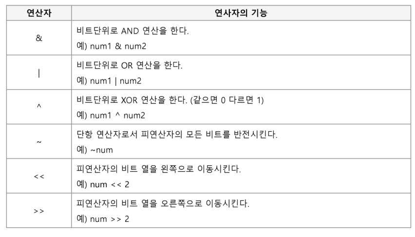
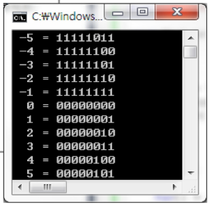
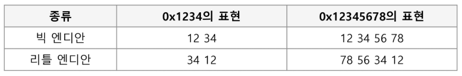
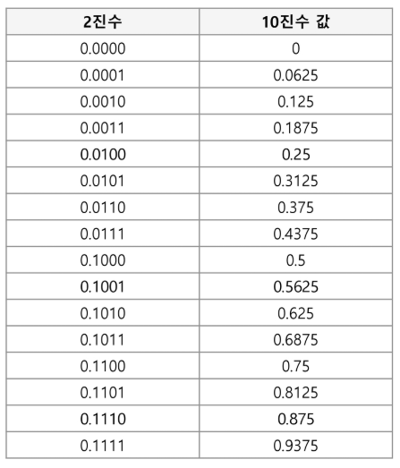
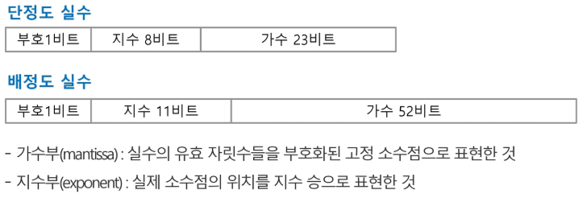
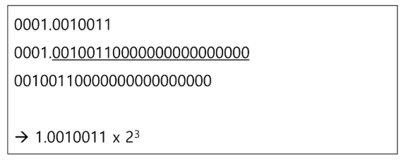
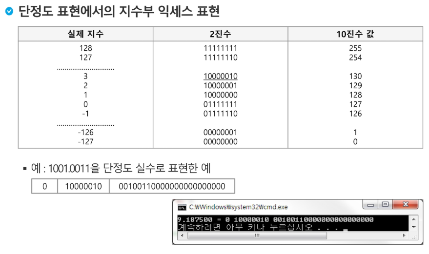
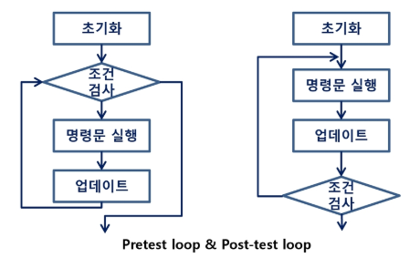
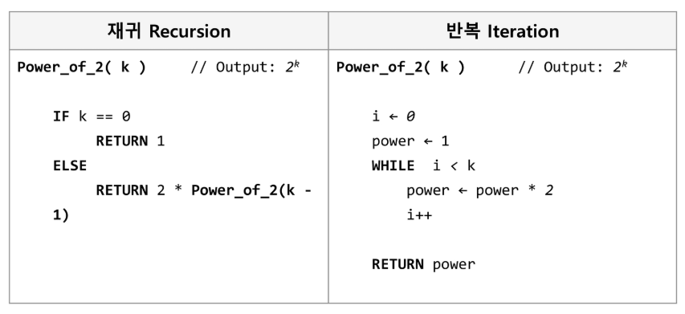

# 1. Start
최적화 문제 => 효율적인 문제 해결 방법을 찾는다

* 알고리즘 설계 기법
  - 완전 탐색
  - 백트래킹
  - 동적 계획법
  - 분할 정복
  - 탐욕
  - 자료 구조들

## SW  문제 해결

* 코딩 교육 이슈

  전세계적으로 관심이 많다

* 브루스 에켈 - 프로그래밍...잘하는 사람과 못하는 사람의 생산성 차이가 스무 배

* SW 문제 해결 역량이란?

  * 프로그램을 하기 위한 많은 제약 조건과 요구 사항을 이해하고 최선의 방법을 찾아내는 능력
  * 추상적인 기술

* 문제 해결 능력 훈련을 위해서?

  * 일부 새로운 언어, 프레임워크, 개발 방법론만을 배워나가는 것만으로 충분하지 않다. 이들을 조합해 나가는 방법을 배워야 하지만 쉽지 않다.


## 복잡도 분석

* Big O 표기법


## 표준 입출력 방법

* 입력

  ```python
  import sys; sys.stdin = open('input.txt', 'r')
  ```

* 출력

  ```python
  print(a)
  ```

  


## 비트 연산

* 비트 연산자

  

* 1 << n

  * 2^n의 값을 갖는다.
  * 원소가 n개일 경우의 모든 부분집합의 수를 의미한다.
  * Power set(모든 부분 집합)
    * 공집합과 자기 자신을 포함한 모든 부분 집합
    * 각 원소가 포함되거나 포함되지 않는 2가지 경우의 수를 계산하면 모든 부분집합의 수가 계산된다.

* i & (1 << j)

  * 계산 결과는 i의 j번째 비트가 1인지 아닌지를 의미한다.

* 비트 연산 예제1

  ```python
  def Bbit_print(i):
      output = ''
      for j in range(7, -1, -1):
          output += '1' if i & (1 << j) else '0'
      print(output)
      
  for i in range(-5, 6):
      print('%3d = ' % i, end='')
      Bbit_print(i)
  ```

  

  음수를 보수 형태로 저장


* 비트 연산 예제2

  ```python
  def Bbit_print(i):
      output = ''
      for j in range(7, -1, -1):
          output += '1' if i & (1<<j) else '0'
      print(output, end='')
  a = 0x10
  x = 0x01020304
  # => 00000001(01) 00000010(02) 00000011(03) 00000100(04)
  print('%d = ' % a, end='')
  Bbit_print(a)
  print()
  print('0%X= '%x, end='')
  for i in range(0, 4):
      Bbit_print((x>>i*8) & 0xff) # 최하위 8비트씩 끊어서 실행
  ```

* 엔디안(Endianness)

  * 컴퓨터의 메모리와 같은 1차원의 공간에 여러 개의 연속된 대상을 배열하는 방법을 의미하며 HW 아키텍처마다 다르다.

  * 주의 : 속도 향상을 위해 바이트 단위와 워드 단위를 변환하여 연산 할 때 올바로 이해하지 않으면 오류를 발생 시킬 수 있다.

  * 엔디안은 크게 두 가지로 나뉨

    * 빅 엔디안(Big-Endian)

      보통 큰 단위가 앞에 나옴. 네트워크

    * 리틀 엔디안(Little-Endian)

      작은 단위가 앞에 나옴. 대다수 데스크탑 컴퓨터

    


* 비트 연산 예제3

  * 엔디안 확인 코드

    ```python
    n = 0x00111111
    
    if n & 0xff:
        print('little endian')
    else:
        print('big endian')
    ```

* 비트 연산 예제4

  * 엔디안 변환 코드

    ```python
    def ce(n): # change endian
        p = []
        for i in range(0, 4):
            p.append((n >> (24 - i*8)) & 0xff)
        return p
    ```

    ```python
    def ce1(n):
        return (n << 24 & 0xff000000) | (n << 8 & 0xff0000) | (n >> 8 0xff00) | (n >> 24 & 0xff)
    ```

    ```python
    x = 0x01020304
    p = []
    for i in range(0, 4):
        p.append((x >> (i*8)) & 0xff)
    print('x = %d%d%d%d' & (p[0], p[1], p[2], p[3]))
    p = ce(x)
    print('x = %d%d%d%d' & (p[0], p[1], p[2], p[3]))
    ```

* 비트 연산 예제5

  * 비트 연산자 ^를 두번 연산하면 처음 값을 반환한다.

    ```python
    def Bbit_print(i):
        output = ''
        for j in range(7, -1, -1):
            output += '1' if i & (1<<j) else '0'
        print(output)
    a = 0x86
    key = 0xAA
    
    print('a ==>', end='')
    Bbit_print(a)
    
    print('a^=key ==>', end='')
    a ^= key
    Bbit_print(a)
    
    print('a^=key ==>', end='')
    a ^= key
    Bbit_print(a)
    ```

    


## 진수

* 2진수, 8진수, 10진수, 16진수

* 10진수 => 타 진수로 변환

  * 원하는 타진법의 수로 나눈 뒤 나머지를 거꾸로 읽는다.

  * (예제) (149)10 = (10010101)2 = (225)8 = (95)16

    

* 타 진수 => 10진수로 변환

  * 예) (135)8 = 1 x 8^2 + 3 x 8^1 + 5 x 8^0 = 93(10)

* 코드 예시

  ```python
  arr = [1, 3, 5]	# 135(8진수)
  val = 0
  for d in arr:
      val = val * 8 + d
  print(val)	# 93(10진수)
  ```

* 컴퓨터에서의 음의 정수 표현 방법

  * 1의 보수 : 부호와 절대값으로 표현된 값을 부호 비트를 제외한 나머지 비트들을 0은 1로, 1은 0으로 변환한다.
    * -6 : 1000 0000 0000 0110 : 부호와 절대값 표현
    * -6 : 1111 1111 1111 1001 : 1의 보수 표현
  * 2의 보수: 1의 보수 방법으로 표현된 값의 최하위 비트에 1을 더한다.
    * -6 : 1111 1111 1111 1010 : 2의 보수 표현

  


## 실수

* 실수의 표현

  * 소수점 이하 4자리를 10진수로 나타내보면

    

  * 컴퓨터는 실수를 표현하기 위해 부동 소수점(floating-point) 표기법을 사용한다.

  * 부동 소수점 표기 방법은 소수점의 위치를 고정시켜 표현하는 방식이다.

    * 소수점의 위치를 왼쪽의 가장 유효한 숫자 다음으로 고정시키고 밑수의 지수승으로 표현

      

* 실수를 저장하기 위한 형식

  * 단정도 실수(32비트)
  * 배정도 실수(64비트)

  

* 단정도 실수의 가수 부분을 만드는 방법

  * 예: 1001.0011

    * 정수부의 첫 번째 자리가 1이 되도록 오른쪽으로 시프트

    * 소수점 이하를 23비트로 만든다

    * 소수점 이하만을 가수 부분에 저장

    * 지수 부분은 시프트 한 자릿수 만큼 증가 또는 감소

      

* 단정도 실수의 지수 부분을 만드는 방법

  * 지수부에는 8비트가 배정(256개의 상태를 나타낼 수 있음)
  * 숫자로는 0-255까지 나타낼 수 있지만, 음수 값을 나타낼 수 있어야 하므로 엑세스(excess) 표현법을 사용
    * 엑세스 표현법: 지수부의 값을 반으로 나누어 그 값을 0으로 간주하여 음수지수와 양수지수를 표현하는 방법

* 단정도 표현에서의 지수부 엑세스 표현

  

* 컴퓨터는 실수를 근사적으로 표현한다.


# 2. 완전 검색 & 그리디

## 반복(Iteration)과 재귀(Recursion)

* 반복과 재귀는 유사한 작업을 수행할 수 있다.

* 반복은 수행하는 작업이 완료될 때까지 계속 반복

  * 루프(for, while 구조)

* 재귀는 주어진 문제의 해를 구하기 위해 동일하면서 더 작은 문제의 해를 이용하는 방법

  * 하나의 큰 문제를 해결할 수 있는(해결하기 쉬운) 더 작은 문제로 쪼개고 결과들을 결합한다.
  * 재귀 함수로 구현

* 반복 구조

  * 초기화(loop Initialization)
    * 반복되는 명령문을 실행하기 전에 (한 번만) 조건 검사에 사용할 변수의 초기값 설정
  * 조건검사(check control expression)
  * 반복할 명령문 실행(action)
  * 업데이트(loop update)
    * 무한 루프(infinite loop)가 되지 않게 거짓(false)이 되게 한다.

  

* 반복을 이용한 선택 정렬; 최솟값을 찾아 맨 오른쪽(왼쪽) 값과 바꾸며 정렬

  ```python
  def SelectionSort(A):
      n = len(A)
      for i in range(0, n-1):
          min = i
          for j in range(i+1, n):
              if A[j] < A[min]:
                  min = j
          temp = A[min]
          A[min] = A[i]
          A[i] = temp
  ```

  ```python
  def selection(my_list):
      n = len(my_list)
      for i in range(0, n-1):
          min = i
          for j in range(i+1, n):
              if my_list[j] < my_list[min]:
                  min = j
          a[i], a[min] = a[min], a[i]
          
  ```

  

* 재귀적 알고리즘

  * 재귀적 정의(문제 정의; 양의 정수)는 두 부분으로 나뉨
  * 하나 또는 그 이상의 기본 경우(basis case or rule)
    * 집합에 포함되어 있는 원소로 induction을 생성하기 위한 시드(seed) 역할
  * 하나 또는 그 이상의 유도된 경우(inductive case or rule)
    * 새로운 집합의 원소를 생성하기 위해 결합되어지는 방법

* 재귀 함수(recursive function)

  * 함수 내부에서 직접 혹은 간접적으로 자기 자신을 호출하는 함수
  * 일반적으로 재귀적 정의를 이용해서 재귀 함수를 구현한다.
  * 따라서, 기본 부분(basis part)와 유도 파트(inductive part)로 구성된다.
  * 재귀적 프로그램을 작성하는 것은 반복 구조에 비해 간결하고 이해하기 쉽다.
  * 함수 호출은 프로그램 메모리 구조에서 스택을 사용. 따라서 재귀 호출은 반복적인 스택의 사용을 의미하며 메모리 및 속도에서 성능저하가 발생한다.

* 팩토리얼 재귀 함수

  * 재귀적 정의

    ```python
    Basis rule:
        N <= 1 경우, n = 1
    Inductive rule:
        N > 1, n! = n X (n-1)!
    ```

  * n! 에 대한 재귀함수

    ```python
    def fact(n):
        if n <= 1:	# Basis part
            return 1
        else:		# Inductive part
            return n * fact(n-1)
    ```

* 반복 또는 재귀?

  * 해결할 문제를 고려해서 반복이나 재귀의 방법을 선택
  * 재귀는 문제 해결을 위한 알고리즘 설계가 간단하고 자연스럽다.
    
    * 추상 자료형(List, tree 등)의 알고리즘은 재귀적 구현이 간단하고 자연스러운 경우가 많다.
  * 일반적으로, 재귀적 알고리즘은 반복(Iterative) 알고리즘보다 더 많은 메모리와 연산을 필요로 한다.
  * 입력 값 n이 커질수록 재귀 알고리즘은 반복에 비해 비효율적일 수 있다.

  * 반복과 재귀의 비교

    |                    |                        재귀                        |         반복          |
    | :----------------: | :------------------------------------------------: | :-------------------: |
    |      **종료**      | 재귀 함수 호출이 종료되는 베이스 케이스(base case) |  반복문의 종료 조건   |
    |   **수행 시간**    |                   (상대적) 느림                    |         빠름          |
    |  **메모리 공간**   |                 (상대적) 많이 사용                 |       적게 사용       |
    | **소스 코드 길이** |                     짧고 간결                      |         길다          |
    | **소스 코드 형태** |                선택 구조(if...else)                | 반복 구조(for, while) |
    |  **무한 반복시**   |                  스택 오버플로우                   |  CPU를 반복해서 점유  |

* 2^k 연산에 대한 재귀와 반복

  

* 재귀로 선택 정렬 구현

  ```python
  def selection(my_list):
      if len(my_list) == 1:
          return
      else:
          print(my_list)
          for j in range(1, len(my_list)):
              if my_list[j] < my_list[0]:
                  k = my_list[j]
                  my_list[j] = my_list[0]
                  my_list[0] = k
              else:
                  pass
          selection(my_list[1:])
  ```


## 완전 검색 기법

* 고지식한 방법(brute-force)

* Brute-force 탐색(sequential search)

  * 자료들의 리스트에서 키 값을 찾기 위해 첫 번째 자료부터 비교하면서 진행한다.
  * 결과 - 탐색 성공 / 탐색 실패

* 완전 검색

  * 모든 경우의 수를 생성하고 테스트 하기 때문에 수행 속도는 느리지만, 해답을 찾아내지 못할 확률이 작다.
    * 완전 검색은 입력의 크기를 작게 해서 간편하고 빠르게 답을 구하는 프로그램을 작성한다.
  * 이를 기반으로 그리디 기법이나 동적 계획법을 이용해서 효율적인 알고리즘을 찾을 수 있다.
  * 검정 등에서 주어진 문제를 풀 때, 우선 완전 검색으로 접근하여 해답을 도출한 후, 성능 개선을 위해 다른 알고리즘을 사용하고 해답을 확인하는 것이 바람직하다.

  * 많은 종류의 문제들이 특정 조건을 만족하는 경우나 요소를 찾는 것.
  * 또한, 이들은 전형적으로 순열, 조합, 그리고 부분집합과 같은 조합적 문제들과 연관된다.
  * 완전 검색은 조합적 문제에 대한 brute-force 방법이다.


## 조합적 문제

* 순열(Permutation)

  * 서로 다른 것들 중 몇개를 뽑아서 한 줄로 나열하는 것
  * 서로 다른 n개 중 r개를 택하는 순열은 nPr과 같이 표현한다.
  * nPr = n x (n-1) x (n-2) x ... x (n-r+1)
  * nPn = n!
  * n! = nx(n-1)x(n-2)x...x2x1

* 다수의 알고리즘 문제들은 순서화된 요소들의 집합에서 최선의 방법을 찾는 것과 관련 있다. ex) TSP(Travelling Salesman Problem)

* 재귀 호출을 통한 순열 생성

  ```python
  perm(n, k):
      if k == n:
          print(arr)
      else:
          for i in range(k, n):
              swap(k, i)
              perm(n, k+1)
              swap(k, i)
  ```

  ```python
  arr = [1, 2, 3, 4]
  N = len(arr)
  for i in range(N):
      arr[1], arr[i] = arr[i], arr[1]
  	
      print(arr)
      arr[0], arr[i] = arr[i], arr[0]
  arr[0], arr[i] = arr[i], arr[0]
  ```


* 조합(combination)

  * 서로 다른 n개의 원소 중 r개를 순서 없이 골라낸 것을 조합이라고 부른다.

  * 조합의 수식

    nCr = n! / (n-r)!r!, (n >= r)

    nCr = n-1Cr-1 + n-1Cr  => 재귀적 표현

    nC0 = 1

  * 재귀 호출을 이용한 조합 생성 알고리즘(별로 효율적이지 않아 잘 쓰이지 않음)

    ```python
    # an[] : n개의 원소를 가지고 있는 배열
    # tr[] : r개의 크기의 배열, 조합이 임시 저장될 배열
    def comb(n, r):
        if r == 0:
            print(arr)
        elif n < r:
            return
        else:
            tr[r-1] = an[n-1]
            comb(n-1, r-1)
            comb(n-1, r)
    ```

  * binomial(n,r)

    ```python
    def binomial(n, r):
        if n == r or r == 0: return 1
        return binomial(n - 1, r - 1) + binomial(n - 1, r)
    ```


## 탐욕 알고리즘

* 탐욕 알고리즘

  * 최적해를 구하는 데 사용되는 근시안적인 방법
  * 일반적으로, 머리 속에 떠오르는 생각을 검증 없이 바로 구현하면 Greedy 접근이 됨
  * 여러 경우 중 하나를 선택할 때 마다 그 순간에 최적이라고 생각되는 것을 선택해 나가는 방식으로 진행하여 최종적인 해답에 도달한다.
  * 각 선택 시점에서 이루어지는 결정은 지역적으로는 최적이지만, 그 선택들을 계속 수집하여 최종적인 해답을 만들었다고 하여, 그것이 최적이라는 보장은 없다.

  * 일단, 한번 선택된 것은 번복하지 않는다. 이런 특성 때문에 대부분의 탐욕 알고리즘들은 단순하며, 또한 제한적인 문제들에 적용된다.
  * 최적화 문제(optimization)란 가능한 해들 중에서 가장 좋은(최대 또는 최소) 해를 찾는 문제이다.

* 탐욕 알고리즘의 동작 과정

  1. 해 선택: 현재 상태에서 부분 문제의 최적 해를 구한 뒤, 이를 부분해 집합에 추가한다.
  2. 실행 가능성 검사: 새로운 부분 해 집합이 실행가능한지를 확인한다. 곧, 문제의 제약 조건을 위반하지 않는 지를 검사한다.
  3. 해 검사: 새로운 부분 해 집합이 문제의 해가 되는지를 확인한다. 아직 전체 문제의 해가 완성되지 않았다면 1의 해 선택부터 다시 시작한다.

* 배낭 짐싸기(Knapsack)

  * 도둑은 부자들의 값진 물건들을 훔치기 위해 보관 창고에 침입

  * 도둑은 훔친 물건을 배낭에 담아 올 계획. 배낭은 담을 수 있는 물건의 총 무게(W)가 정해져 있다.

  * 창고에는 여러 개(n개)의 물건들이 있고 각각의 물건에는 무게와 값이 정해져있다.

  * 경비원들에 발각되기 전에 배낭이 수용할 수 있는 무게를 초과하지 않으면서, 값이 최대가 되는 물건들을 담아야 한다.

    | 배낭(30kg) |      |          |
    | :--------: | :--: | :------: |
    |    물건    | 무게 |    값    |
    |   물건1    | 25kg | 10천만원 |
    |   물건2    | 10kg | 9천만원  |
    |   물건3    | 10kg | 5천만원  |
    |    ...     | ...  |   ...    |


# 3. 분할 정복 & 백트래킹

## 순열/조합 생성

## DP

## 퀵 정렬

# 4. 그래프

## 최단 경로

## 최소신장트리

# 5. 문자열

## 접미어 트리, 접미어 배열

## 허프만 트리

# 6. DP1

# 7. DP2

# 8. 근사해, 경우의 수, 확률, 정수론